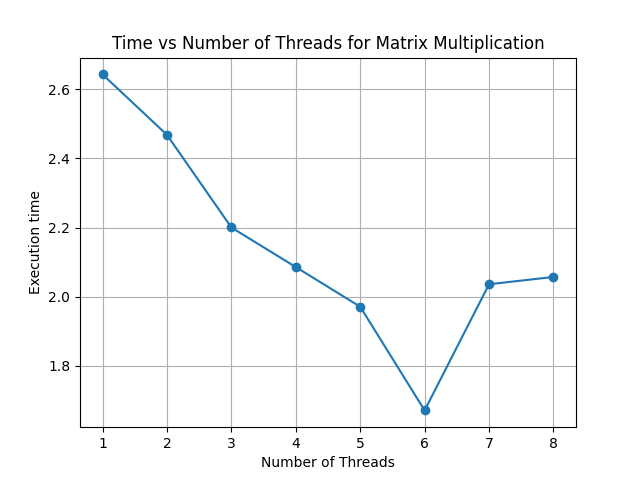
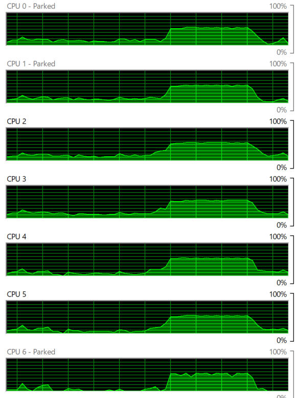

# Matrix Multiplication with Multithreading

The Python code benchmarks the execution time of matrix multiplication using multithreading. It generates random matrices and performs matrix multiplication with a fixed matrix using multiple threads. The number of threads used is varied, and the execution time is recorded for each configuration. Finally, it plots the relationship between the number of threads and the execution time to analyze the scalability of matrix multiplication with multithreading.

## Usage

To run the script, make sure you have Python installed. Then, simply execute the script:

-main.py

## Time taken(seconds) v/s no. of Threads:

| Thread 1 | Thread 2 | Thread 3 | Thread 4 | Thread 5 | Thread 6 | Thread 7 | Thread 8 |
|----------|----------|----------|----------|----------|----------|----------|----------|
| 2.643     | 2.468     | 2.200    | 2.085    | 1.970    | 1.670    | 2.035    | 2.045     |

## Resource Usage

